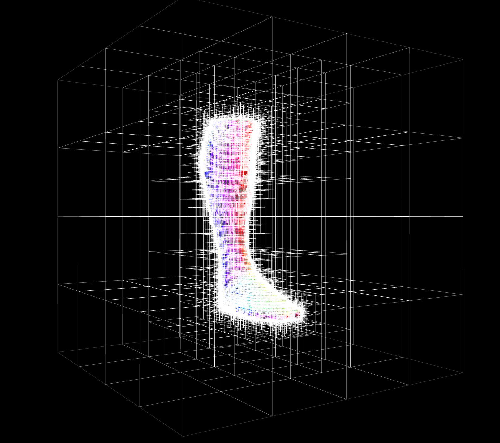

# haar-tree-3d
This module is an implementation of a sparse 3-dimensional Haar wavelet basis. You can use it to do the following:

* Voxelize boundary representations (polygons, meshes, etc.)
* Fill holes in meshes
* Smooth or clean up noisy data

The rasterization technique is based on the following paper:

J. Manson, S. Schaefer. (2011) "[Wavelet Rasterization](http://josiahmanson.com/research/wavelet_rasterization/)", Computer Graphics Forum



## Install

```
npm i haar-tree-3d
```

## Example

```javascript
const bunny = require('bunny')
const rasterize = require('haar-tree-3d/rasterize-cells')
const contour = require('haar-tree-3d/contour')

// renders the bunny mesh into a wavelet basis
const tree = rasterize(bunny.cells, bunny.positions, {depth: 6})

// extracts an isosurface mesh contour
const isomesh = contour(tree)
```

## Usage

### Rasterization

#### `var tree = require('haar-tree-3d/rasterize-cells)(cells, positions[, options])`

Rasterizes a triangular mesh into a sparse wavelet representation

* `cells` cells are the faces of the mesh
* `positions` positions are the locations of the vertices of the mesh
* `options`
    + `options.depth` depth is the depth of the octree

**Returns** A sparse wavelet tree encoding the meshes

### Sampling

#### `var value = require('haar-tree-3d/sample')(tree, x, y, z)`
Samples the Haar wavelet tree at a specific point `(x, y, z)` in 3D space

* `tree` is the Haar tree
* `x,y,z` are the coordinates of the point

#### `var array = require('haar-tree-3d/to-ndarray')(tree[, options])`
Converts the Haar tree into an ndarray.  Note that this representation is not very efficient.

* `tree` is the Haar tree

### Contouring

#### `var mesh = require('haar-tree-3d/contour')(tree)`
Extracts a contour from a mesh field

* `tree` is a Haar tree


## Credits


Development supported by [Standard Cyborg](http://www.standardcyborg.com).

(c) 2017- Mikola Lysenko
